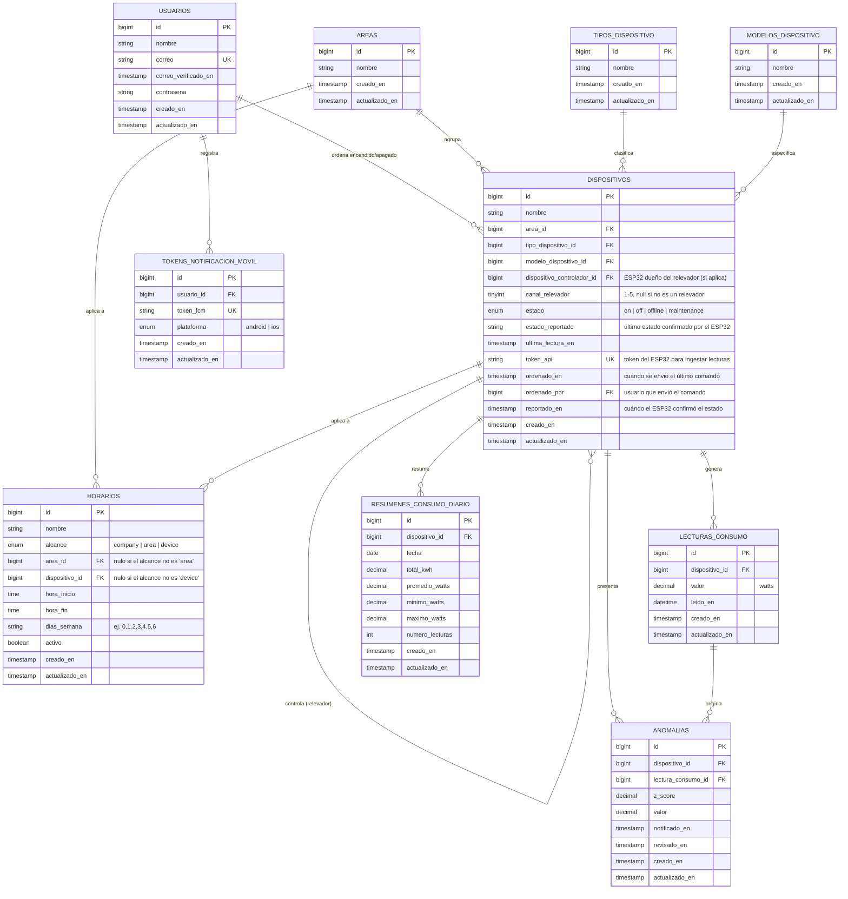

# Diagrama Entidad-Relación — Enermetrica

> Este diagrama usa **nombres en español** solo para fines de documentación y
> entendimiento del modelo de datos. La base de datos real (tablas y columnas
> en Laravel) sigue usando nombres en **inglés** (ver tabla de equivalencias al
> final), ya que renombrarlas implicaría migraciones y cambios en todo el
> código (modelos, controladores, la app Flutter, etc.).
>
> Formato: [Mermaid](https://mermaid.js.org/syntax/entityRelationshipDiagram.html).
> Puedes editarlo aquí mismo o pegarlo en https://mermaid.live para verlo y
> modificarlo visualmente.

## Equivalencia con los nombres reales (tablas/columnas en inglés)

| Entidad (español)           | Tabla real (inglés)             | Notas |
|------------------------------|----------------------------------|-------|
| USUARIOS                     | `users`                          | Incluye `name`, `email`, `password`, etc. |
| AREAS                        | `areas`                          | |
| TIPOS_DISPOSITIVO            | `device_types`                   | |
| MODELOS_DISPOSITIVO          | `device_models`                  | |
| DISPOSITIVOS                 | `devices`                        | `area_id`, `device_type_id`, `device_model_id`, `controller_device_id`, `relay_channel`, `status`, `reported_status`, `last_reading_at`, `api_token`, `commanded_at`, `commanded_by`, `reported_at` |
| LECTURAS_CONSUMO             | `consumption_readings`           | `device_id`, `value`, `read_at` |
| HORARIOS                     | `schedules`                      | `scope`, `area_id`, `device_id`, `start_time`, `end_time`, `weekdays`, `is_active` |
| ANOMALIAS                    | `anomalies`                      | `device_id`, `consumption_reading_id`, `z_score`, `value`, `notified_at`, `reviewed_at` |
| TOKENS_NOTIFICACION_MOVIL    | `device_tokens`                  | `user_id`, `fcm_token`, `platform` — **ojo**: a pesar del nombre, esta tabla guarda tokens de notificaciones push del celular del usuario, no de los dispositivos IoT (eso lo maneja `devices.api_token`) |
| RESUMENES_CONSUMO_DIARIO     | `daily_consumption_summaries`    | `device_id`, `date`, `total_kwh`, `avg_watts`, `min_watts`, `max_watts`, `readings_count` |

No se incluyen las tablas internas de Laravel (`sessions`, `cache`, `jobs`,
`password_reset_tokens`, `personal_access_tokens`) por no ser parte del
dominio de negocio.
